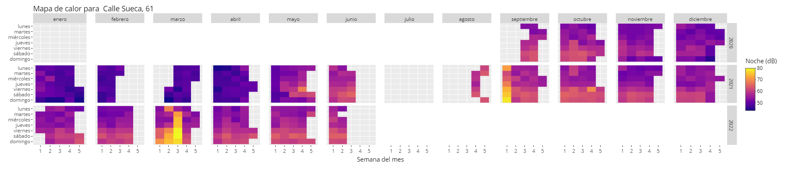

<style type="text/css">
  body{
  font-size: 12pt;
}
</style>

```{css, echo=FALSE}
.header-section-number::after {
  content: ".";
}
```

```{r setup, cache = F, echo = F, message = F, warning = F, tidy = F}
# CONFIGURACIÓN GENERAL
library(knitr)
options(width = 100)
# Opciones generales chunks
opts_chunk$set(echo=T,message = F, error = F, warning = F, comment = NA, 
               fig.align = 'center', dpi = 100, tidy = F, 
               cache.path = '.cache/', fig.path = './figure/')

#options(xtable.type = 'html')
knit_hooks$set(inline = function(x) {
  
  if(is.numeric(x)) {
    round(x, getOption('digits'))
  } else {
    paste(as.character(x), collapse = ', ')
  }
})
#knit_hooks$set(plot = knitr:::hook_plot_html)
```

```{r, echo=F, include=F}
# Especificamos las librerías necesarias en esta lista

packages = c("knitr","tidyverse", "lubridate", "magrittr", "leaflet", "shiny",
             "shinythemes", "GGally", "forcats", "ggridges", "viridis", "naniar",
             "skimr", "leaflet.extras", "htmlwidgets", "kableExtra")

# Función que comprueba si tenemos instalado un paquete
# Si está instalado, lo carga
# Si no, lo instala y lo carga

package.check <- lapply(packages, FUN = function(x) {
  if (!require(x, character.only = TRUE)) {
    install.packages(x, dependencies = TRUE)
    library(x, character.only = TRUE)
  }
})

# Mostrar los paquetes cargados
search()

```

# Introducción

Este proyecto tiene como objetivo crear una aplicación web interactiva que puede ser de utilidad para el ciudadano. La aplicación permitirá visualizar los datos de catorce sonómetros situados en distintas calles del barrio de Ruzafa, además de poder identificarlos en un mapa, también interactivo. 

Con ello queremos conseguir que cualquier ciudadano pueda ver de forma fácil e intuitiva los niveles de ruido en el barrio de Ruzafa, en Valencia. De esta manera, podrá plantear preguntas y contestarlas mediante la visualización para llegar a sus propias conclusiones. 

Para un ciudadano medio, los datos son poco más que una ristra de letras y números; apenas tienen importancia. Sin embargo, observados a través de una buena visualización, pueden llegar a tener un gran impacto. Más aún si uno mismo puede decidir qué es lo que quiere visualizar. Es importante recordar que lo que aprendemos jugando e interactuando se interioriza a un nivel mayor, ya que creamos nuestras propias asociaciones y experiencias.

Los datos de los sensores han sido obtenidos del portal de datos abiertos del Ayuntamiento de Valencia: <https://www.valencia.es/dadesobertes/es/data/?groups=medio-ambiente>

El enlace a la aplicación web creada es el siguiente (acceder después de leer el informe): https://olafmeneses.shinyapps.io/ruzafapp/

El enlace también se encuentra al final del documento; lo pongo aquí por facilidad y comodidad. 

# Aviso previo sobre el informe

Este informe no muestra en ningún momento bloques de código del lenguaje en el que se ha programado (`R`). La intención de esto es que el informe pueda ser comprendido en su práctica totalidad por personas ajenas al ámbito de la informática o programación. Si se desea ver el código utilizado para este informe y la aplicación web, se puede encontrar en el siguiente enlace: <https://github.com/Wooflaf/Ruzafapp>.

El único término que creemos que puede ser desconocido para algunos lectores es el siguiente:

* *DataFrame*: estructura de datos donde se guardan distintos tipos de datos. La idea intuitiva es que es parecido a una hoja de cálculo de Excel o una tabla donde cada columna es una variable y cada fila corresponde a un registro.

# Descarga de datos

Para descargar los datos, hemos optado por automatizar la descarga, ya que cada día se añade un nuevo registro. Para ello, hemos obtenido los identificadores y con estos hemos podido automatizar el proceso.

Asimismo, hemos obtenido la longitud y latitud de los sonómetros (información presente en la página correspondiente a cada sensor), ya que puede sernos de interés para realizar una visualización geográfica.

```{r, echo = F}
ids <- c("a54fb175-8013-460a-a2f0-22de7a210d7a", # Ponemos los ids para 
         "75a878a9-2bd9-4619-98ec-3224be867c65", # facilitar la descarga
         "6fa5210b-f9c7-47c8-9d1f-ddb7568f62de",
         "5a050cef-1107-4b3b-8e61-5daf5cfb2ca4",
         "e580f492-a2f6-4305-af24-f4c4d05b911c",
         "8058f1a5-c605-4baa-afff-2f638efb767f",
         "d842601d-35b4-4b88-96f7-42e8f68e1b74",
         "ea008906-e06a-4c72-9fe6-3238e212aae4",
         "64e4b7b4-e633-4753-b0ef-a57d785076f8",
         "ff8678b6-748e-4908-ab5b-9c7ff567da61",
         "b26d42ae-2be9-481a-9b79-71392d9e80bd",
         "1b41d86b-3939-488b-9035-92d851245924",
         "784f4732-abc5-41b1-857b-42decb306643",
         "3b2fe345-08fc-49d7-85c8-8cccf6a7e814")

names(ids) <- c("sueca_esq_denia", # Asociamos el nombre de la calle al id
                "cadiz16",
                "cadiz3",
                "cuba3",
                "sueca2",
                "sueca61",
                "sueca32",
                "carlescervera_reina",
                "salvador",
                "vivons",
                "carlescervera34",
                "puertorico21",
                "docserrano21",
                "gen_prim")

# Registramos la latitud y longitud de la posición de los sensores
latitude <- c(39.4628376,
              39.4631424,
              39.4640447,
              39.4628861,
              39.4633107,
              39.4605601,
              39.4613594,
              39.4613005,
              39.4635655, 
              39.4599927,
              39.4615883, 
              39.4609867,
              39.4626872,
              39.4625622)

longitude <- c(-0.37588849999997365,
              -0.3746647000000394,
              -0.3750515000000405,
              -0.3775977000000239,
              -0.3766378000000259,
              -0.37411520000000564,
              -0.37514680000003864,
              -0.37288599999999406,
              -0.37060220000000754,
              -0.3721407000000454,
              -0.3727962000000389,
              -0.3761412000000064,
              -0.3737806999999975,
              -0.370427100000029)

urls <- paste0("https://opendata.vlci.valencia.es/datastore/dump/", ids,
               "?format=csv&bom=true")

destfiles <- paste0("./data/", names(ids), ".csv")

# Descargamos los archivos
for(i in seq_along(urls)){
   download.file(urls[i], destfiles[i])
}
```

## Nombres de los sensores
A continuación se muestra una tabla explicativa del nombre abreviado asignado a cada sensor y a qué calle corresponde para facilitar la comprensión.

```{r tablas_informativas, echo = FALSE}
# Cargamos de un script tablas que servirán para informar sobre los nombres de las calles donde se ubican los sensores, las escalas de ruido...
source("tablas_informativas.R", encoding = "UTF-8")
kbl(nombres_calle) %>%
  kable_material(full_width = F) %>% 
  kable_styling(bootstrap_options = c("striped", "hover", "responsive"))
```

# Carga de datos

Para los datos de cada sensor, los hemos almacenado en dataframes independientes. Además hemos añadido una columna con el nombre abreviado de la calle donde se ubica cada uno, para una más fácil identificación.

Posteriormente, como todos los dataframes comparten las mismas variables (columnas), hemos unido todos los registros en un solo dataframe.

```{r, echo = F}
# Asignamos a cada nombre de calle el dataframe que corresponde a sus datos.
for(i in seq_along(ids)){
  assign(names(ids)[i],
         read_csv(destfiles[i],
                  col_types = cols(dateObserved = col_date(format = "%Y-%m-%d"))) %>% 
           mutate(street = names(ids)[i]))
}

# Creamos un dataframe que reúna los datos de todas las calles
all_df <- bind_rows(sueca_esq_denia, cadiz16, cadiz3, cuba3, sueca2, sueca61, 
                    sueca32, carlescervera_reina, salvador, vivons, 
                    carlescervera34, puertorico21, docserrano21, gen_prim)

# Borramos los dataframes individuales que ya no necesitamos
rm(sueca_esq_denia, cadiz16, cadiz3, cuba3, sueca2, sueca61, 
   sueca32, carlescervera_reina, salvador, vivons, carlescervera34,
   puertorico21, docserrano21, gen_prim)
```
## Definición de las variables relacionadas con el sonido
A continuación se muestra una tabla con las explicaciones proporcionadas por el Ayuntamiento de Valencia para las variables relacionadas con el sonido.
```{r tablas_LAeq, echo = FALSE}
kable(explicacion_medidas, escape = FALSE) %>%
  kable_material(full_width = F) %>% 
  kable_styling(bootstrap_options = c("striped", "hover", "responsive"))
```

# Limpiado del dataframe

Seleccionamos las variables que nos interesan y transformamos las variables al tipo de variable que corresponda.

```{r, echo = F}
all_df %<>%
  select(-`_id`:-entityType) %>% 
  mutate(entityId = factor(entityId),
         street = factor(street))
```

## Valores erróneos

Generamos un resumen genérico del dataframe para tener una idea de qué datos pueden ser erróneos, o que faltan.

```{r, echo = F}
my_skim <- skim_with(numeric = sfl(hist = NULL))
list <- partition(my_skim(all_df))
```
__Variables de tipo Fecha__
```{r, echo = F}
list$Date %>% kable() %>% 
  kable_styling(bootstrap_options = c("striped", "hover", "responsive"),
                htmltable_class = "lightable-material")
```

__Variables categóricas__
```{r, echo = F}
list$factor %>% kable() %>% 
  kable_styling(bootstrap_options = c("striped", "hover", "responsive"),
                htmltable_class = "lightable-material")
```

__Variables numéricas__
```{r, echo = F}
list$numeric %>% kable() %>% 
  kable_styling(bootstrap_options = c("striped", "hover", "responsive"),
                htmltable_class = "lightable-material")
```

Observamos que no hay valores faltantes (`n_missing`). Lo interesante de aquí es que hay valores infinitos en algunas variables numéricas. El resto de variables parecen no contener errores. Procedemos a identificar estos registros.

```{r, echo = F}
all_df %>% # Veamos si hay valores que no son posibles
  filter(if_any(starts_with("LA"), ~ !is.finite(.x) | .x <= 0)) %>% 
  kbl() %>% 
  kable_material() %>% 
  kable_styling(bootstrap_options = c("striped", "hover", "responsive")) 
```

Hay dos registros que tienen valores infinitos en alguna variable. Esto es imposible y, por tanto, erróneo. El resto de valores parecen estar bien registrados, podríamos cambiar el infinito por NA. No obstante, como la proporción es muy baja (2 registros de `r nrow(all_df)`), lo que haremos sera eliminarlos directamente.

```{r, echo = F}
all_df %<>%
  filter(if_all(starts_with("LA"), ~ is.finite(.x) & .x > 0))
```

# Visualización de registros faltantes

Hemos hecho un dataframe donde para cada día que hay registro de datos para al menos un sensor, completamos para el resto de sensores con valores `NA`. Esto nos permitirá visualizar los registros faltantes.

```{r, echo = F}
# Creamos un dataframe que incluya todas las fechas y que complete con NAs
# si el sensor de esa calle no registró los valores de esa fecha.
complete_data <- all_df  %>% 
  arrange(dateObserved) %>% 
  complete(dateObserved, nesting(street, entityId))
```

```{r, echo = F}
# Visualizamos los datos faltantes
vis_miss(complete_data) +
  labs(y = "Registros") +
  scale_fill_manual(values = c("grey", "black"), name = "", labels = c("No faltante", "Faltante"))
```

Observamos que de los registros que faltan, todas las variables relacionadas con el sonido están incompletas (pues así lo hemos completado nosotros). Esto quiere decir que hay días en los que algunos sensores no han hecho ningún registro. Asimismo, vemos que para los días que hay registro, todas las variables están completas. Como ya vimos en el resumen generado en el apartado anterior.

```{r, echo = F}
# Tabla que muestra la calle donde se sitúa el sensor y la cantidad de días
# sin datos registrados
complete_data %>% 
  filter(is.na(LAeq)) %>% 
  count(street) %>%
  ggplot(aes(x = fct_reorder(street, n), n)) +
  geom_col() +
  geom_text(aes(label = n), vjust = -0.5, size = 4) + 
  coord_cartesian(ylim = c(-5, 240)) +
  labs(x = "Calle", y = "Registros faltantes", 
       title = "Número de registros faltantes por sensor") +
  theme(axis.text.x = element_text(hjust = 0.5, vjust = 0.5, angle=90))
```

También hemos contabilizado cuántos días no tienen registros los sensores con al menos un registro faltante. Hay una gran diferencia entre el sensor de `sueca2` y los demás. En el siguiente gráfico a este podremos visualizarlo de otra forma que nos proporcionará mas información.

```{r, echo = F}
# Gráfico que muestra los valores de LAeq (en azul) según la fecha para cada calle
# y en rojo los días que no hubo registro.
ggplot(complete_data,
       aes(x = dateObserved,
           y = LAeq)) +
 geom_miss_point(alpha = 0.4) +
 facet_wrap(~street) +
  labs(x = "Fecha", title = "Datos faltantes en cada sensor") +
  theme(axis.text.x = element_text(hjust = 0.5, vjust = 0.5, angle=90)) +
  scale_color_discrete(name = "Datos faltantes", labels = c("Faltante", "No Faltante"))
```

En este último gráfico podemos ver qué días no hay registros para cada sensor.

Observamos que hay sensores que tienen registros faltantes al inicio (sonómetro `salvador`); es posible que se deba a que se colocasen más tarde. El más interesante puede ser el caso de `sueca2`, donde hay una gran falta de registros y a partir de un cierto día, ya no se registran más. Desconocemos la razón por la que este sensor no registra más datos.

# ¿Influye la presencia de bares y restaurantes en los niveles de ruido registrados?
Según un [estudio de concentración de locales en el barrio de Ruzafa](http://www.valencia.es/ayuntamiento/urbanismo2.nsf/0/A577FFDD7E036298C1257D180037E247/$FILE/MODIFICACI%C3%93%20DE%20LES%20NORMES%20URBAN%C3%8DSTIQUES%20DEL%20PLA%20ESPECIAL%20DE%20RUSSAFA-SUD%20GRAN%20VIA%20(PEP-2).pdf?OpenElement?d&embedded=true), realizado por el Ayuntamiento de Valencia en Mayo de 2014, el número total de bares y restaurantes era de 277; 11.37 bares por cada 1000 habitantes del barrio de Ruzafa, es decir, 1.96 veces la media de la ciudad en esas fechas.

Por eso mismo creemos que influirá mucho en los niveles de ruido registrados. Lo comprobaremos haciendo uso de los datos, mediante una visualización geográfica de la ubicación de los sonómetros, bares y restaurantes. Pero, ¿cómo obtener sus respectivas ubicaciones? ¿Qué bares hay en Ruzafa? 

## Datos de bares y restaurantes
Lo que hemos realizado es obtener mediante web scraping (técnica para extraer información de sitios web) la información de estos servicios de hostelería. Los datos han sido extraídos de Google Maps, datos que se pueden obtener haciendo las búsquedas de 'restaurantes ruzafa' y 'bares ruzafa'. No creemos haber conseguido la totalidad de servicios, pero sí los suficientes como para hacer una buena representación.
```{r load hosteleria, echo = F}
# Carga de datos de bares y restaurantes
bares <- read_delim("./data/bares_ruzafa.csv", delim = "\t", 
                    escape_double = FALSE, trim_ws = TRUE) %>% 
  rename_with(function(x){x <- "name"}, starts_with("Name"))

restaurantes <- read_delim("./data/restaurantes_ruzafa.csv", delim = "\t", 
                           escape_double = FALSE, trim_ws = TRUE) %>% 
  rename_with(function(x){x <- "name"}, starts_with("Name"))
```
Haremos un limpiado básico de los datos para que se adecúen a aquello que buscamos.
```{r clean hosteleria, echo = F}
# Filtraremos los posibles duplicados
mismos_locales <- base::intersect(bares$name, restaurantes$name) 

hosteleria <- bind_rows(bares, 
                        restaurantes %>% filter(!(name %in% mismos_locales))) %>% 
  select(name, Category, domingo:sábado, Address, Latitude, Longitude) %>% # Variables de posible interés
  filter(between(Longitude, -0.38, -0.368) & between(Latitude, 39.458, 39.465)) %>% 
  filter(!(Category %in% c("Mercado", "Iglesia Católica", "Salón de manicura y pedicura")))
# Filtramos los servicios de hostelería en un rectángulo concreto.
# Eliminamos categorías que no se corresponden con servicios de hostelería.
```
```{r, echo = F} 
glimpse(hosteleria) # Estructura del dataframe final 
```
Tenemos un total de 226 registros de servicios de hostelería y su correspondiente información.
```{r, echo = F}
vis_miss(hosteleria) +
  labs(y = "Registros") +
  scale_fill_manual(values = c("grey", "black"), name = "", labels = c("No faltante", "Faltante"))
```
Observamos que solo faltan datos en las variables que corresponden a los horarios. No utilizaremos por ahora esa información, por lo que no es importante que falten esos datos. Podemos proceder a visualizarlos.

## Dataframe de ubicaciones
```{r df_ubi, echo = F}
lat_ord <- latitude[order(names(ids))]
lon_ord <- longitude[order(names(ids))]

# Dataframe con las ubicaciones y las medianas (según el sensor) de las variables relacionadas con el sonido 
all_df_ubi_median <- complete_data %>% 
  mutate(latitude = rep(lat_ord, nrow(complete_data)/length(ids)),
         longitude = rep(lon_ord, nrow(complete_data)/length(ids))) %>% 
  filter(if_all(everything(), ~!is.na(.x))) %>%
  group_by(street, latitude, longitude) %>% 
  summarise(across(ends_with("LAeq"), ~median(.x), .names = "median_{.col}")) %>% 
  mutate(nivel = case_when(median_LAeq >= 60.8 ~ "Nivel 3", # Etiquetas para clasificar los más y menos ruidosos
                           median_LAeq < 60.8 & median_LAeq >= 59 ~ "Nivel 2",
                           median_LAeq < 59 ~ "Nivel 1")) %>% 
  arrange(desc(median_LAeq)) %>% 
  ungroup()

all_df_ubi_median[1:4] %>% 
  kbl(align = "lccc", col.names = c("Calle", "Latitud", "Longitud", "Mediana LAeq")) %>%
  kable_material(full_width = F) %>% 
  pack_rows("Nivel 3", 1, 6, background = "darkred", color = "white") %>% 
  pack_rows("Nivel 2", 7, 11, background = "red", color = "white") %>% 
  pack_rows("Nivel 1", 12, 14, background = "salmon", color = "white")
```
Utilizaremos este dataframe para la visualización geográfica. Notar que se muestran ya los diferentes niveles establecidos. La diferenciación entre ellos son los valores de la mediana de la variable `LAeq`. El nivel 3 es para valores mayores de 60.8, el nivel 2 si los valores están entre 59 y 60.8 y finalmente, el nivel 1, es para valores menores de 59.

## Visualización geográfica
A través del paquete `leaflet` podemos visualizar los sensores en su localización correspondiente, así como los servicios de hostelería que hay a su alrededor. Es un gráfico interactivo; es muy aconsejable leer antes la información del siguiente punto, en las conclusiones.
```{r icons_infobox, echo = FALSE}
# Cargamos de un script los iconos que utilizaremos en la visualización geográfica, así como el texto que tendrá un botón informativo sobre la visualización
source("leaflet_icons_infobox.R", encoding = "UTF-8")
```

```{r leaflet, echo = FALSE}
all_df_ubi_median <- all_df_ubi_median %>% # Variable scaled: median_LAeq entre 0 y 1
  mutate(scaled = (median_LAeq - min(median_LAeq))/(max(median_LAeq)-min(median_LAeq)))

# Ponemos la variable entre 0 y 1 para poder aplicarle una paleta de colores
color_pal <- colorNumeric(palette = colorRamp(c("#FDD49E", "#7F0000"), 
                                              interpolate="spline"),
                          all_df_ubi_median$scaled)

leaflet(width = "100%") %>%
  addProviderTiles(providers$OpenStreetMap.HOT) %>%
  addAwesomeMarkers(data = hosteleria, lng = ~Longitude, lat = ~Latitude, # Marcadores de hostelería
                    clusterOptions = markerClusterOptions(), # Agrupación de marcadores
                    icon = icon_hosteleria,
                    label = ~name,
                    popup = paste0(
                      "<b> Nombre: </b>",
                      hosteleria$name,
                      "<br>",
                      "<b> Categoría: </b>",
                      hosteleria$Category,
                      "<br>",
                      "<b> Dirección: </b>",
                      hosteleria$Address)) %>% 
  setView(lng = median(hosteleria$Longitude), # Vista inicial: mediana de lats y longs para que esté 'centrada'
          lat = median(hosteleria$Latitude), zoom = 16) %>%
  addAwesomeMarkers(data = all_df_ubi_median, lng = ~longitude, lat = ~latitude, # Marcadores sonómetros
                    icon = ~icon_sonometro[nivel],
                    label = ~street,
                    group = "sonometros",
                    popup = paste0(
                      "<b> Nombre: </b>",
                      all_df_ubi_median$street,
                      "<br>",
                      "<b> Mediana LAeq: </b>",
                      all_df_ubi_median$median_LAeq, " dB")) %>% 
  addCircleMarkers(data = all_df_ubi_median, lng = ~longitude, lat = ~latitude,
                   radius = ~3*sqrt(median_LAeq),
                   opacity = 0.8,
                   color = ~color_pal(scaled),
                   fillOpacity = 0.6) %>% 
  addLegend(position = "bottomright", # Añadimos una leyenda orientativa
            labels = c("Nivel 3", "Nivel 2", "Nivel 1"), 
            colors = c("darkred", "red", "salmon"),
            opacity = .7,
            title = "Sonómetros") %>%
  addResetMapButton() %>% # Botón para poder volver a la vista inicial
  addSearchFeatures(targetGroups = "sonometros") %>% # Botón de búsqueda de sonómetro
  addBootstrapDependency() %>%
  addEasyButton(easyButton(
    icon = "glyphicon-info-sign", title = "Información del mapa",
    onClick = JS("function(btn, map){ $('#infobox').modal('show'); }")
  )) %>%
  htmlwidgets::appendContent(info.box)
```
# Conclusiones de la visualización geográfica
Gracias a esta visualización podemos observar claramente que los sensores que tienen muchos bares y restaurantes alrededor tienen niveles de ruido mayores. Cuanto más oscuro sea el rojo del círculo que rodea al sensor, más ruidoso es. De la misma forma, cuanto más claro, menos ruidoso.

Notar que es una visualización interactiva. En la esquina superior izquierda, si se hace click en el último botón, se muestra la información relativa a los botones y la interactividad, entre otras cosas. Es recomendable leer esa información y probar a interactuar con el mapa.

Si miramos un poco el mapa, no tardará en aflorar la pregunta: ¿por qué el sensor `cadiz3` es (según nuestro criterio) el más ruidoso, pero no tiene apenas bares o restaurantes alrededor? La respuesta es sencilla. Solo hace falta ver que está situado frente a Gran Via de les Germanies, una vía urbana muy transitada.

Es decir, el ruido que hace la gente en bares y restaurantes es una de las causas de estos altos niveles de ruido, pero también lo es el tráfico de vehículos. Sobre todo en las zonas más próximas a vías urbanas muy transitadas, como es el caso anterior.

# Visualización interactiva
Hemos creado una visualización que son varios mapas de calor, divididos por año y mes. 



En el eje X tenemos los días de la semana y el eje Y representa la semana dentro del mes correspondiente (varía entre 1-5). Es una visualización muy interesante, ya que de un solo vistazo, podemos observar cuándo se dan valores más altos o más bajos de ruido.

Pensamos que dejarlo en un gráfico estático sería desaprovechar todo su potencial. Por eso mismo, hemos creado una aplicación con el paquete `shiny` que permite modificar a gusto del usuario distintos parámetros. 

En la imagen previa, se muestra el correspondiente mapa de calor para el sensor situado en C/ Sueca 61, y se observa el ruido nocturno. Podemos ver fácilmente que a medida que las restricciones del ocio nocturno por la Covid-19 se relajan, los colores son más anaranjados o amarillentos, es decir, un mayor ruido. Observamos también que son más habituales valores más altos los viernes, sábados y domingos.

Con la interactividad, las posibilidades de extraer información son mayores. El objetivo es que no haya unas preguntas fijas a contestar. Más bien todo lo contrario. Es el propio usuario quien debe plantear las preguntas e, interactuando con los distintos gráficos, pueda sacar sus conclusiones.

La aplicación está disponible a través del siguiente enlace: https://olafmeneses.shinyapps.io/ruzafapp/

```{r shiny-data, include = F}
ultimo_dia_mes <- function(date){
  as.Date(date) %m+% months(1) %m-% days(1)
}

date_df <- all_df %>%
  group_by(entityId, street) %>%
  complete(dateObserved = c(seq.Date(from = as.Date("2020-09-01"),
                                     to = ultimo_dia_mes(today()),
                                     by = "day"))) %>%
  mutate(year = year(dateObserved),
         month = month(dateObserved, label = T, abbr = F),
         weekdayf = factor(wday(dateObserved, label = T,
                                week_start = 1, abbr = F), ordered = T),
         monthweek = ceiling(day(dateObserved) / 7)) %>%
  select(-LAeq) %>% 
  pivot_longer(starts_with("LAeq"), 
               names_to = "medida", 
               values_to = "valor") %>%
  mutate(text = ifelse(is.na(valor),
                       paste0("Fecha: ", day(dateObserved)," de ",
                              month(dateObserved, label = T, abbr = F), " \n",
                              "No hay registro de este día"),
                       paste0("Valor: ", valor, " dB\n", "Fecha: ",
                              day(dateObserved)," de ",
                              month(dateObserved, label = T, abbr = F), " \n",
                              "Día: ", str_to_title(weekdayf), " \n"))) %>%  
  mutate(medida = case_when(medida == "LAeq_d" ~ "7:00 - 19:00",
                            medida == "LAeq_den" ~ "Todo el día",
                            medida == "LAeq_e" ~ "19:00 - 23:00",
                            medida == "LAeq_n" ~ "23:00 - 7:00"))

date_df_eng <- all_df %>%
  group_by(entityId, street) %>%
  complete(dateObserved = c(seq.Date(from = as.Date("2020-09-01"),
                                     to = ultimo_dia_mes(today()),
                                     by = "day"))) %>%
  mutate(year = year(dateObserved),
         month = month(dateObserved, label = T, abbr = F, 
                       locale = "English_United States"),
         weekdayf = factor(wday(dateObserved, label = T,
                                week_start = 1, abbr = F,
                                locale = "English_United States"),
                           ordered = T),
         monthweek = ceiling(day(dateObserved) / 7)) %>%
  select(-LAeq) %>% 
  pivot_longer(starts_with("LAeq"), 
               names_to = "medida", 
               values_to = "valor") %>%
  mutate(text = ifelse(is.na(valor),
                       paste0("Date: ", day(dateObserved)," of ", month, " \n",
                              "There is no record for this day"),
                       paste0("Value: ", valor, " dB\n", "Date: ",
                              day(dateObserved)," of ", month, " \n",
                              "Day: ", str_to_title(weekdayf), " \n"))) %>% 
  mutate(medida = case_when(medida == "LAeq_d" ~ "7:00 - 19:00",
                            medida == "LAeq_den" ~ "All day",
                            medida == "LAeq_e" ~ "19:00 - 23:00",
                            medida == "LAeq_n" ~ "23:00 - 7:00"))

# Guardamos las variables que serán utilizadas en la aplicación Shiny en un .RData que posteriormente cargaremos.
save(list = c("ids", "all_df", "hosteleria", "all_df_ubi_median", "date_df"),
     file = "./Ruzafapp/data/data.Rdata")

save(list = c("ids", "all_df", "hosteleria", "all_df_ubi_median", "date_df_eng"),
     file = "./Ruzafapp_eng/data/data.RData")
```

# Conclusiones finales
Para concluir, haremos un repaso general de las conclusiones que hemos extraído de los distintos gráficos y tablas.

* Los niveles de ruido son muy altos, en la mayoría de casos por encima o cerca de los 55 dB, límite máximo permisible para zonas residenciales.

* Una mayor presencia de bares y restaurantes indica unos niveles de ruido mayores.

* Al contrario no siempre sucede. Hay otros factores, como estar próximo a una vía transitada, que influyen en los niveles de ruido.

* Tras el fin de las restricciones Covid para el ocio nocturno, los niveles de ruido por la tarde y noche aumentan considerablemente.

* Los días de Fallas son los que concentran los valores más altos de ruido para todos los sensores.

* Hemos desarrollado una aplicación web que puede ser de utilidad para el ciudadano. Permite visualizar los datos de los sensores y configurar la visualización a su gusto, además de incluir una representación geográfica de los sensores y servicios de hostelería próximos.